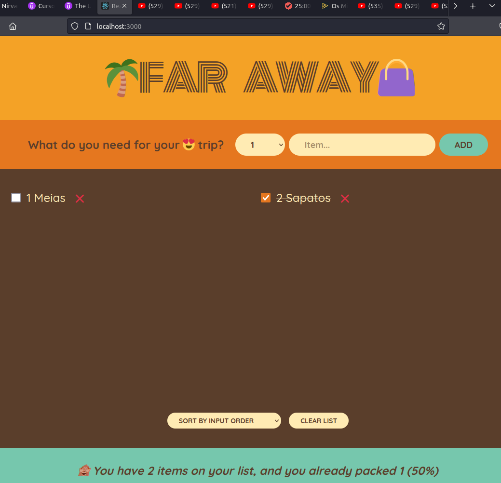

# Travel list

Projeto construido no curso The Ultimate React Course 2023: React, Redux & More pelo instrutor Jonas Schmedtmann

[🔗 Clique aqui para acessar](https://mateusalmeida31415.github.io/counter/)

## 🛠 Tecnologias

- HTML
- CSS
- JSX
- Git e Github
- React

## Aprendizado

- Iniciar um projeto com create react app
- Criar e usar componentes
- Usar eventos
- Usar variaveis de estado e props
- Render condicional
- Usar a sintaxe do JSX
- Destructuring props
- Render list
- Render com operador ternario
- React fragment
- Classes e conteúdo de forma condicional
- Children prop
- Formularios
- Lifting up state
